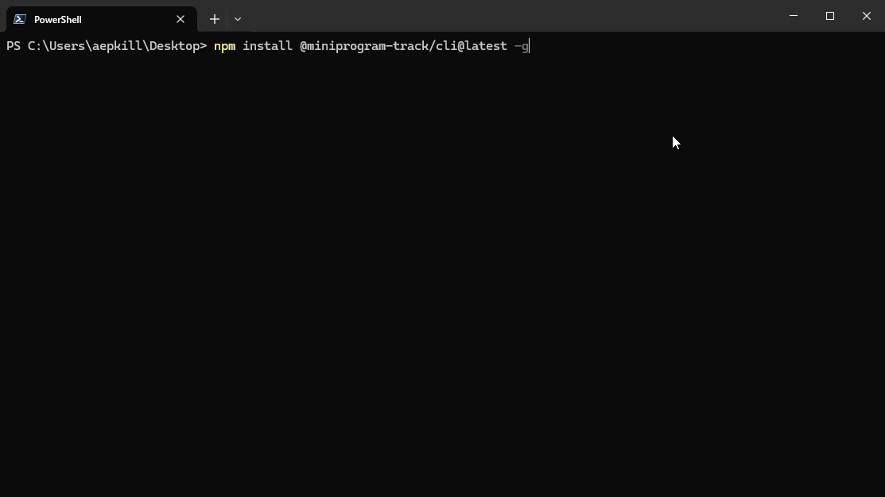

# Miniprogram track

Miniprogram track 是用于小程序安全审计的工具包

## 免责声明

本工具仅用于安全审计。用户在使用此工具时，应遵守所有适用的法律和法规。用户需对其使用此工具的行为负责，作者不承担因用户的行为产生的任何法律责任。

## 预览

## 安装

 `npm install @miniprogram-track/cli -g`

## 快速开始

1. 使用 `miniprogram-track scan` 命令扫描小程序
2. 使用 `miniprogram-track unpack --pkgPath <pkgPath>` 命令解包小程序，解包后的小程序会在当前目录下生成一个名为 `<appid>` 的文件夹

## Roadmap

- 微信小程序
  - [x] windows 端扫描小程序
  - [x] 反编译小程序
  - [x] 反编译小程序分包
  - [ ] 还原小程序目录结构
  - [ ] windows 端打开小程序调试器

## 参考资料

- [微信小程序源码阅读笔记1](https://lrdcq.com/me/read.php/66.htm)
- [wxapkg - 微信小程序反编译工具，.wxapkg 文件扫描 + 解密 + 解包工具](https://github.com/wux1an/wxapkg)
- [将微信小程序(.wxapkg)解包及将包内内容还原为"编译"前的内容的"反编译"器](https://zhuanlan.zhihu.com/p/558998021)
- [SS.UnWxapkg](https://github.com/chenrensong/SS.UnWxapkg)
- [手把手教你—微信小程序抓包解密与反编译工具的使用全过程（超详细）](https://juejin.cn/post/7312678013559636006)
- [【Web实战】零基础微信小程序逆向](https://forum.butian.net/share/2570)
- [windows pc端wxpkg文件解密（非解包）](https://github.com/BlackTrace/pc_wxapkg_decrypt)
- [实战微信逆向教程](https://www.youtube.com/playlist?list=PLwIrqQCQ5pQmA0OBlMtRCx1FLa3KMQXIJ)
- [PcWeChatHooK](https://github.com/zmrbak/PcWeChatHooK)
- [WeChat-Hook](https://github.com/aixed/WeChat-Hook)
- [RevokeMsgPatcher](https://github.com/huiyadanli/RevokeMsgPatcher)
  
## License

MIT © AEPKILL
